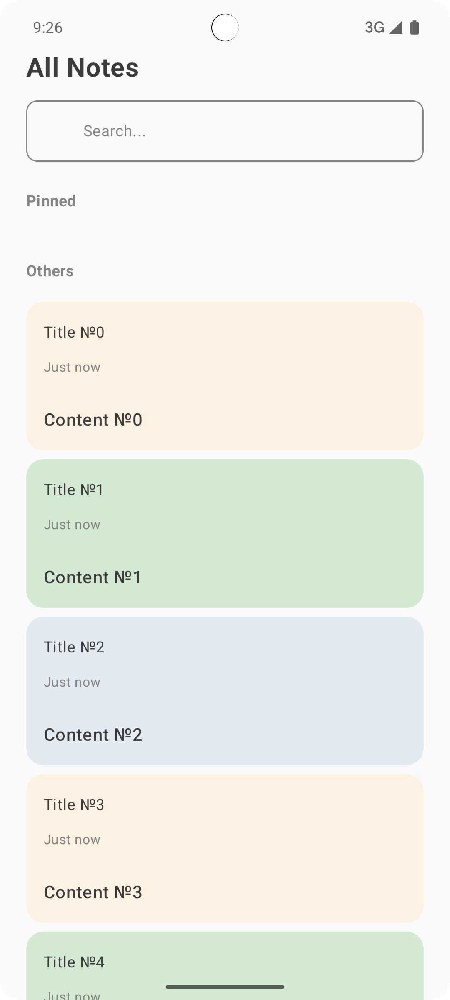
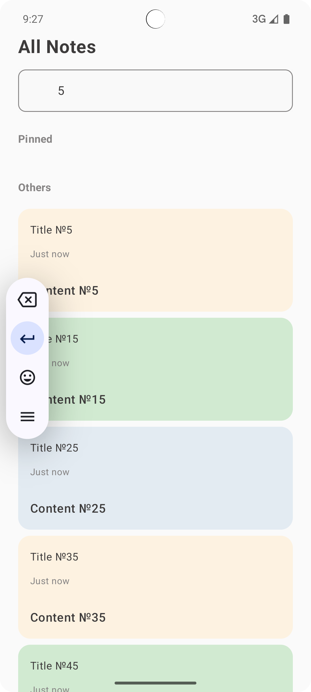
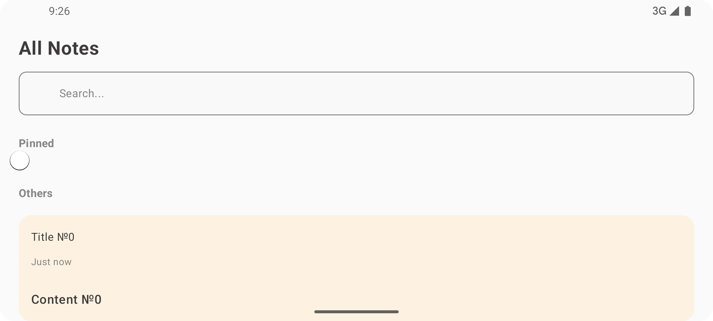

Notes App

Приложение для создания, редактирования и управления заметками на Android, написанное на Kotlin с использованием Jetpack Compose.

Скриншоты:

  
  
  

Особенности

- Отображение всех заметок с разделением на закреплённые и обычные.
- Поиск заметок по заголовку и содержимому.
- Добавление, редактирование и удаление заметок (пока в памяти, без базы данных).
- Закрепление/открепление заметок с помощью долгого нажатия.
- Удобный интерфейс с использованием Jetpack Compose.
- Форматирование даты с отображением "Just now", "X h ago" или конкретной даты.

Текущая реализация

- Все заметки хранятся в памяти (TestNotesRepositoryImpl).
- Главный экран (NotesScreen) отображает список заметок.
- Используется MVVM и Flow для реактивного обновления UI.
- Временные заметки добавляются автоматически для демонстрации.

Планируемые улучшения

- Подключение базы данных Room для постоянного хранения заметок.
- Второй экран для добавления/редактирования заметок.
- Улучшение UI и анимаций.

Запуск

1. Клонировать репозиторий: git clone https://github.com/galaxykud/notes-app.git
2. Открыть в Android Studio
3. Запустить на эмуляторе или устройстве
